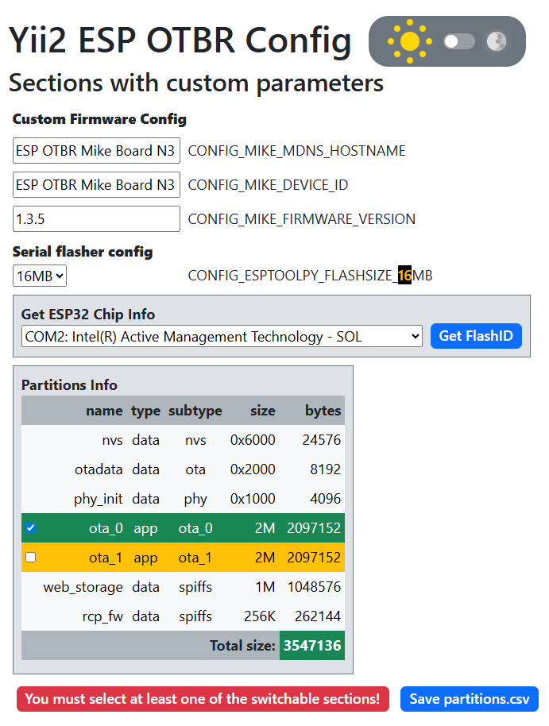

# ESP-IDF 5.4.1 OTBR Example 1.2 Optimization
Based on [ESP-THREAD-BR Release v1.2](https://github.com/espressif/esp-thread-br/releases/tag/v1.2)  
  
*Content:*  
- [**1) Web Page**](#web-page)  
Changing flash settings, saving external scripts locally, minifying code, password protection  
- **2) Configuration parameters**  
Changing configuration parameters  
- **3) mDNS: instance name and hostname**  
More recognizable names for border routers in Home Assistant and mDNS  
- **4) OTA web page**  
Adding/modifying source code, minifying code, creating a visual interface for firmware  
- **5) Yii2 ESP-IDF Config**  
Creating a visual interface for managing the settings of the ESP OTBR example  
    
*Links:*  
- [Crypt utility](crypt/)  
- [Minify utility](minify/)  
- [Optimized code](optimized/)  
- [Source code of external JS and CSS libraries](src/)  
- [Yii2 web configurator](web/)  
  

# 1) Web Page

Considering that the ESP32-S3 chip on the ESP OTBR board can have 8MB or 16MB of flash memory, we can optimize the web page code inside the OTBR.  
Moreover, we can set custom values for mDNS instance name and mDNS hostname.  
  
In any case, this is worth checking if the flash memory capacity is really more than 4MB:  
~~~
esptool -p COM3 flash_id
~~~
> Detecting chip type... ESP32-S3  
> Chip is ESP32-S3 (QFN56) (revision v0.1)  
> Features: WiFi, BLE, Embedded PSRAM 2MB (AP_3v3)  
> Crystal is 40MHz  
> Manufacturer: c8  
> Device: 4018  
> Detected flash size: **16MB**  
> Flash type set in eFuse: quad (4 data lines)  
> Flash voltage set by eFuse to 3.3V  
  
  
## Change partition table
/examples/basic_thread_border_router/partitions.csv:  
Increase web_storage to **1M** or more...  
Additionally, we can increase the OTA block size to **2M** and reduce the excess RCP block size to **256K**.  
~~~
nvs,        data, nvs,      , 0x6000,
otadata,    data, ota,      , 0x2000,
phy_init,   data, phy,      , 0x1000,
ota_0,      app,  ota_0,    , 2M,
ota_1,      app,  ota_1,    , 2M,
web_storage,data, spiffs,   , 1M,
rcp_fw,     data, spiffs,   , 256K,
~~~

## Change flash value in configuration
/examples/basic_thread_border_router/sdkconfig.defaults:  
Change *ESPTOOLPY_FLASHSIZE_4MB* to **ESPTOOLPY_FLASHSIZE_8MB** or **ESPTOOLPY_FLASHSIZE_16MB**
>  
> CONFIG_ESPTOOLPY_FLASHSIZE_8MB=y  
>  
  
Or  
  
>  
> CONFIG_ESPTOOLPY_FLASHSIZE_16MB=y  
>  
  
The original HTML includes 3 links:
~~~
<link href="https://cdn.jsdelivr.net/npm/bootstrap@3.3.7/dist/css/bootstrap.min.css" rel="stylesheet">

~~~

## Save external scripts locally
1) /components/esp_ot_br_server/frontend/static/static.min.css  
Download *https://cdn.jsdelivr.net/npm/bootstrap@3.3.7/dist/css/bootstrap.min.css* and put its code into the **static.min.css** file.

2) /components/esp_ot_br_server/frontend/static/static.min.js  
Download *https://code.jquery.com/jquery-1.10.2.min.js* and *https://d3js.org/d3.v3.min.js* and put their code into the **static.min.js** file.

Add a few lines to the */components/esp_ot_br_server/src/esp_br_web.c*:
~~~
...
    //-- added external css
    } else if (strcmp(info.file_name, "/static/static.min.css") == 0) {
        return style_css_get_handler(req, info.file_path);
    //-- added external js
    } else if (strcmp(info.file_name, "/static/static.min.js") == 0) {
        return script_js_get_handler(req, info.file_path);
...
~~~
It might be correct to change WEB_TAG from "obtr_web" to "otbr_web" (OpenThread Border Router) there:
~~~
#define WEB_TAG "otbr_web"
~~~

## Switch theme
Switching between dark and light themes occurs by clicking the "sun/moon" icons.  
- DARK theme:  
  
  
  
- LIGHT theme:  
  

  
Add a few lines to the */components/esp_ot_br_server/frontend/index.html*:
~~~
<!-- dark theme -->
<link href="/static/style-dark.min.css" type="text/css" rel="stylesheet">
<link href="/static/icons.min.css" type="text/css" rel="stylesheet">

~~~
Add a few lines to the */components/esp_ot_br_server/src/esp_br_web.c*:
~~~
...
    //-- added dark theme css
    } else if (strcmp(info.file_name, "/static/style-dark.min.css") == 0) {
        return style_css_get_handler(req, info.file_path);
    //-- added theme-switch.min.js
    } else if (strcmp(info.file_name, "/static/theme-switch.min.js") == 0) {
        return script_js_get_handler(req, info.file_path);
    //-- added minified icons.min.css
    } else if (strcmp(info.file_name, "/static/icons.min.css") == 0) {
        return style_css_get_handler(req, info.file_path);
...
~~~

## Minify code
We can also minify html, js and css using the [*minify*](minify/) PHP-script:
  
Add new lines to the *esp_br_web.c* file:
~~~
...
    //-- added minified html
    } else if (strcmp(info.file_name, "/index.min.html") == 0) {
        return index_html_get_handler(req, info.file_path);
    //-- added minified css
    } else if (strcmp(info.file_name, "/static/style.min.css") == 0) {
        return style_css_get_handler(req, info.file_path);
    //-- added minified js
    } else if (strcmp(info.file_name, "/static/restful.min.js") == 0) {
        return script_js_get_handler(req, info.file_path);
...
~~~
Hide or remove old lines in file *esp_br_web.c*:
~~~
...
/*
    } else if (strcmp(info.file_name, "/static/style.css") == 0) {
        return style_css_get_handler(req, info.file_path);
    } else if (strcmp(info.file_name, "/static/restful.js") == 0) {
        return script_js_get_handler(req, info.file_path);
*/
...
~~~
Run PHP-script:
~~~
-----------------------------------------------
| File name           |    Source |  Minified |
-----------------------------------------------
| index.min.html      |     22556 |     16025 |
| restful.min.js      |     31645 |     15018 |
| style.min.css       |     31553 |     23913 |
| style-dark.min.css  |     10166 |      8157 |
| theme-switch.min.js |      1685 |      1168 |
| icons.min.css       |      6974 |      4479 |
-----------------------------------------------
~~~
*P.S. To run minify for JS correctly, it's necessary to make edits to the **restful.js** file code - to put the missing semicolons at the end of the expressions.*  

## Password protected web page
The original HTML ([crypt](crypt/)) includes 2 links:
~~~

~~~

1) Download *https://cdnjs.cloudflare.com/ajax/libs/crypto-js/4.0.0/core.min.js* and *https://cdnjs.cloudflare.com/ajax/libs/crypto-js/3.1.9-1/md5.min.js* and put their code into the **static.min.js** file.
2) Add code from the [crypt](crypt/) folder: html code to *index.html*, css code to *static/style.css* and js code to *restful.js*.  
3) Using the following commands we will get the MD5 sequence for the login and password,
~~~
const username = 'my_username';
const password = 'my_password';
const crypt_usr = CryptoJS.MD5(username).toString();
const crypt_pwd = CryptoJS.MD5(password).toString();
console.log('username:', username, ', MD5 username:', crypt_usr, 'password:', password, ', MD5 password: ', crypt_pwd);
~~~
>  
> username: my_username, MD5 username: 70410b7ffa7b5fb23e87cfaa9c5fc258, password: my_password, MD5 password: a865a7e0ddbf35fa6f6a232e0893bea4  
>  
  
replace the value of the MD5_USERNAME and MD5_PASSWORD variables in the JS code: 
~~~
const MD5_USERNAME = '70410b7ffa7b5fb23e87cfaa9c5fc258';
const MD5_PASSWORD = 'a865a7e0ddbf35fa6f6a232e0893bea4';
~~~
Now when opening a web page we will have to log in with the saved username and password. If there is an error filling out the authorization form, the message "Invalid credentials" will be displayed.  
  
  
  

## Final stage
After that we need to compile and flash the firmware to get the latest version!  
  
When the web server starts, we will see something like this:  
~~~ 
I (10386) otbr_web: <=======================server start========================>  
I (10386) otbr_web: http://192.168.1.250:80/index.html  
I (10386) otbr_web: <===========================================================>  
~~~ 
or, in my version of the code (*esp_br_web.c*) :)  
~~~
ESP_LOGW(WEB_TAG, "### Server start ##########################");
ESP_LOGW(WEB_TAG, "#");
ESP_LOGW(WEB_TAG, "#   http://%s:%d/index.html", s_server.ip, s_server.port);
ESP_LOGW(WEB_TAG, "#");
ESP_LOGW(WEB_TAG, "###########################################");
~~~
it looks like:
~~~ 
W (4565) otbr_web: ### Server start ##########################
W (4565) otbr_web: #
W (4565) otbr_web: #   http://192.168.1.250:80/index.html
W (4565) otbr_web: #
W (4565) otbr_web: ###########################################
~~~ 
So, we can run this URL, http://192.168.1.250:80/index.html or its minified version http://192.168.1.250:80/index.min.html 

# 2) Configuration parameters
/examples/basic_thread_border_router/sdkconfig.defaults:  
Add to the beginning of the file:  
>  
> \# begin of ESP32-S3  
> CONFIG_IDF_TARGET="esp32s3"  
> CONFIG_OPENTHREAD_BR_AUTO_START=y  
> CONFIG_OPENTHREAD_BR_START_WEB=y  
> \# end of ESP32-S3  
>   
> \# begin of Custom Firmware Config  
> CONFIG_MIKE_MDNS_HOSTNAME="ESP OTBR Mike Board N3 OTA"  
> CONFIG_MIKE_DEVICE_ID="ESP OTBR Mike Board N3 OTA"  
> CONFIG_MIKE_FIRMWARE_VERSION="1.3.5"  
> \# end of Custom Firmware Config  
>   
  
***See "3) mDNS: custom instance name and hostname" section for descriptions of the "CONFIG_MIKE_MDNS_HOSTNAME" parameter!***  
    
Add to the "Ethernet" section:  
> CONFIG_EXAMPLE_CONNECT_ETHERNET=y  
> CONFIG_EXAMPLE_ETHERNET_EMAC_TASK_STACK_SIZE=2048  
> CONFIG_EXAMPLE_USE_SPI_ETHERNET=y  
  
Add "Wi-Fi" section:  
> \# begin of Wi-Fi
> CONFIG_EXAMPLE_CONNECT_WIFI=y  
> CONFIG_EXAMPLE_PROVIDE_WIFI_CONSOLE_CMD=y  
> CONFIG_EXAMPLE_WIFI_SSID="NETIS_WIFI_24"  
> CONFIG_EXAMPLE_WIFI_PASSWORD="secret_password"  
> CONFIG_EXAMPLE_WIFI_CONN_MAX_RETRY=1000000  
> \# end of Wi-Fi  
  
# 3) mDNS: custom instance name and hostname
The "CONFIG_MIKE_MDNS_HOSTNAME" parameter specifies custom values for the mDNS instance name and mDNS hostname.  
  
Example: the value of this parameter "ESP OTBR Mike Board N5" will be displayed in the flow network as:  
- Instance name: display name (ESP OTBR Mike Board N5)  
- Host name: technical name (esp-otbr-mike-board-n5.local)  
 
Adding the "CONFIG_MIKE_MDNS_HOSTNAME" parameter will affect edits in several places of the application:  
- adding the *main/Kconfig.projbuild* file with the necessary settings for "idf.py menuconfig"  
- adding the *main/mdns_utils.c* file, containing a function for correctly converting the parameter value to Hostname  
- adding the *main/mdns_utils.h* file, containing a declaration of the function from *main/mdns_utils.c*  
- adding code to the *main/CMakeLists.txt* file to include *main/mdns_utils.c* in the compilation process  
~~~
idf_component_register(SRCS "esp_ot_br.c" "mdns_utils.c"
~~~
- adding code to the *main/esp_ot_br.c* file to condition the use of this parameter  
~~~
...
#ifdef CONFIG_MIKE_MDNS_HOSTNAME
  #include "mdns_utils.h"
#endif
...
    #ifdef CONFIG_MIKE_MDNS_HOSTNAME
      char hostname[256];
      //-- convert instance name to correct hostname
      hostname_optimized(CONFIG_MIKE_MDNS_HOSTNAME, hostname);
      ESP_ERROR_CHECK(mdns_hostname_set(hostname));
      ESP_ERROR_CHECK(mdns_instance_name_set(CONFIG_MIKE_MDNS_HOSTNAME));
    #else
      //-- default values
      ESP_ERROR_CHECK(mdns_hostname_set("esp-ot-br"));
    #endif
...
~~~
- Added to /examples/basic_thread_border_router/main/CMakeLists.txt
~~~
idf_component_register(SRCS ... "mdns_utils.c"
~~~

  
  

# 4) OTA web page
- Added /components/esp_ot_br_server/frontend/ota.html
- Added /components/esp_ot_br_server/frontend/static/ota.css
- Added /components/esp_ot_br_server/frontend/static/ota.js
- Added /components/esp_ot_br_server/include/esp_br_ota.h
- Added /components/esp_ot_br_server/src/esp_br_ota.c
- Added to /components/esp_ot_br_server/src/esp_br_web.c
~~~
#include "esp_br_ota.h"
~~~

## Switch theme
Switching between dark and light themes occurs by clicking the "sun/moon" icons.  
- DARK theme:  
  
  
- LIGHT theme:  
  
  
Add a few lines to the */components/esp_ot_br_server/frontend/ota.html*:
~~~
<!-- dark theme -->

<link href="/static/ota-dark.min.css" type="text/css" rel="stylesheet">
<link href="/static/icons.min.css" type="text/css" rel="stylesheet">
~~~
Add a few lines to the */components/esp_ot_br_server/src/esp_br_web.c*:
~~~
...
    //-- added minified OTA html
    } else if (strcmp(info.file_name, "/ota.min.html") == 0) {
        return index_html_get_handler(req, info.file_path);
    //-- added minified OTA js
    } else if (strcmp(info.file_name, "/static/ota.min.js") == 0) {
        return script_js_get_handler(req, info.file_path);
    //-- added minified OTA css
    } else if (strcmp(info.file_name, "/static/ota.min.css") == 0) {
        return style_css_get_handler(req, info.file_path);
    //-- added minified ota-dark.min.css
    } else if (strcmp(info.file_name, "/static/ota-dark.min.css") == 0) {
        return style_css_get_handler(req, info.file_path);
...
~~~

## Minify code
We can also minify html, js and css using the [*minify*](minify/) PHP-script:
~~~
-----------------------------------------------
| File name           |    Source |  Minified |
-----------------------------------------------
| theme-switch.min.js |      1685 |      1168 |
| icons.min.css       |      6974 |      4479 |
| ota.min.html        |      4040 |      2825 |
| ota.min.js          |      7720 |      3750 |
| ota.min.css         |      2570 |      1835 |
| ota-dark.min.css    |      7982 |      5191 |
-----------------------------------------------
~~~
Add new lines to the *esp_br_web.c* file:
~~~
    ...
    //-- added minified OTA html
    } else if (strcmp(info.file_name, "/ota.min.html") == 0) {
        return index_html_get_handler(req, info.file_path);
    //-- added minified OTA js
    } else if (strcmp(info.file_name, "/static/ota.min.js") == 0) {
        return script_js_get_handler(req, info.file_path);
    //-- added minified OTA css
    } else if (strcmp(info.file_name, "/static/ota.min.css") == 0) {
        return style_css_get_handler(req, info.file_path);
    ...
~~~
~~~
    ...
    //-- ADD: +8 URI handlers for API URIs (for OTA)
    config.max_uri_handlers = 8 + (sizeof(s_resource_handlers) + sizeof(s_web_gui_handlers)) / sizeof(httpd_uri_t) + 2;
    config.max_resp_headers = 8 + (sizeof(s_resource_handlers) + sizeof(s_web_gui_handlers)) / sizeof(httpd_uri_t) + 2;
    ...
~~~
~~~
    ...
    //-- ADDED: OTA handler registration
    esp_br_register_ota_handlers(s_server.handle);
    ...
~~~
- Added to /components/esp_ot_br_server/CMakeLists.txt
~~~
REQUIRES ... app_update
~~~
- Replaced /components/esp_ot_br_server/favicon.ico
- Added to /examples/basic_thread_border_router/main two parameters:
~~~
...
config MIKE_DEVICE_ID
...
config MIKE_FIRMWARE_VERSION
...
~~~
- Launch web page: http://192.168.1.250/ota.min.html
  
  
  
  
  
  
  
  
  
  
  

# 5) Yii2 ESP OTBR Config
- install in */web/yii2* folder (the *vendor* folder will be created):
~~~
composer install
~~~
- launch web server in */web* folder (it will be accessible on *http://localhost:8000*):
~~~
php -S 127.0.0.1:8000
~~~
- ***sdkconfig.defaults*** must have a strict structure (each configuration block must start with the line "# begin of..." and end with the line "# end of...")
~~~
\# begin of Custom Firmware Config
CONFIG_MIKE_MDNS_HOSTNAME="ESP OTBR Mike Board N3 OTA"
CONFIG_MIKE_DEVICE_ID="ESP OTBR Mike Board N3 OTA"
CONFIG_MIKE_FIRMWARE_VERSION="1.3.5"
\# end of Custom Firmware Config
~~~
  
- Section: "status" -1 means "not used, not shown" (for configurations), 0 - "switchable, now is disabled" and 1 - "switchable, now is enabled"
- Params: "custom" 0 - "not used, not shown" and 1 - "can be changed"
  
  
## a) Switchable Sections
At least one of the sections must be selected!  
  
"Ethernet" parameters do not need to be changed, and "Wi-Fi" parameters (SSID and password) can be set in the custom parameters section.  
  
  
## b) Sections with custom parameters 
  
These parameters are used to display more recognizable names in Home Assistant and on the OTA firmware web page:  
  
  
  

## c) Flash size settings
To utilize the ESP32 chip's flash memory capacity, we can use the "Get ESP32 chip information" block and select the corresponding COM port to which the ESP32 chip is connected.  
To check whether the ESP32 has sufficient flash memory, we can use the "Partition information" block, which allows you to enable/disable OTA blocks.  
The red background of the "Total size" value in "Partition Info" indicates that the Flash RAM size is insufficient for correct flashing of OTA blocks.  
  

When we select a COM port and click the "Get FlashID" button, the esptool command is launched to obtain the parameters of the ESP32 chip connected to the selected COM port.  
  

If the ESP32 chip is not connected to the COM port or is faulty, we will get an error.  
  

Correctly connecting the ESP32 to the COM port will provide information about the chip type and the size of its flash memory.  
The "Set" button will appear above the "Get ESP32 Chip Info" block.  
  
  
When we press the "Set" button that appears above the "Get ESP32 Chip Info" block, the value of the "CONFIG_ESPTOOLPY_FLASHSIZE_..." parameter will take the value of the received flash memory size.  
The green background for the "Total Size" value in "Partition Information" indicates that the Flash RAM size is sufficient for correct flashing of OTA blocks.  
  

We can use one OTA block (**not recommended!**). 
  

We can disable OTA completely.  
  

Don't forget to save changes in the corresponding files!  
  

## d) Switch theme
Switching between dark and light themes occurs by clicking the "sun/moon" icons.  
- DARK theme:  
  
  
- LIGHT theme:  
  
  