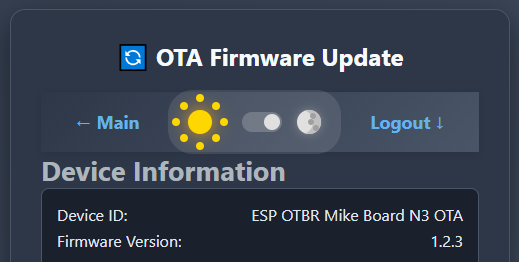
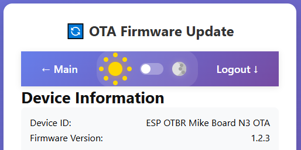
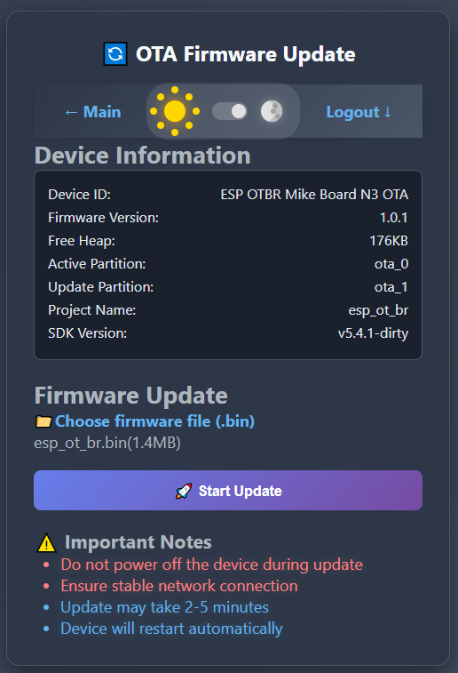
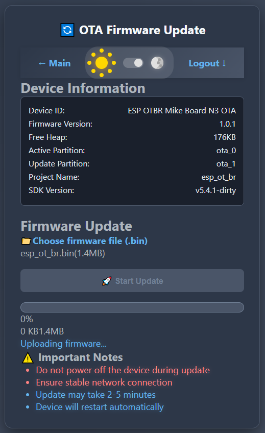

# ESP-IDF 5.4.1 OTBR Example 1.2 Optimization
Based on [ESP-THREAD-BR Release v1.2](https://github.com/espressif/esp-thread-br/releases/tag/v1.2)  
  

# 4) OTA web page
[Return to top](README.md#otbr-top)  
- Added /components/esp_ot_br_server/frontend/ota.html
- Added /components/esp_ot_br_server/frontend/static/ota.css
- Added /components/esp_ot_br_server/frontend/static/ota.js
- Added /components/esp_ot_br_server/include/esp_br_ota.h
- Added /components/esp_ot_br_server/src/esp_br_ota.c
- Added to /components/esp_ot_br_server/src/esp_br_web.c
~~~
#include "esp_br_ota.h"
~~~

## Switch theme
Switching between dark and light themes occurs by clicking the "sun/moon" icons.  
- DARK theme:  
  
  
- LIGHT theme:  
  
  
Add a few lines to the */components/esp_ot_br_server/frontend/ota.html*:
~~~
<!-- dark theme -->

<link href="/static/ota-dark.min.css" type="text/css" rel="stylesheet">
<link href="/static/icons.min.css" type="text/css" rel="stylesheet">
~~~
Add a few lines to the */components/esp_ot_br_server/src/esp_br_web.c*:
~~~
...
    //-- added minified OTA html
    } else if (strcmp(info.file_name, "/ota.min.html") == 0) {
        return index_html_get_handler(req, info.file_path);
    //-- added minified OTA js
    } else if (strcmp(info.file_name, "/static/ota.min.js") == 0) {
        return script_js_get_handler(req, info.file_path);
    //-- added minified OTA css
    } else if (strcmp(info.file_name, "/static/ota.min.css") == 0) {
        return style_css_get_handler(req, info.file_path);
    //-- added minified ota-dark.min.css
    } else if (strcmp(info.file_name, "/static/ota-dark.min.css") == 0) {
        return style_css_get_handler(req, info.file_path);
...
~~~

## Minify code
We can also minify html, js and css using the [*minify*](minify/) PHP-script:
~~~
-----------------------------------------------
| File name           |    Source |  Minified |
-----------------------------------------------
| theme-switch.min.js |      1685 |      1168 |
| icons.min.css       |      6974 |      4479 |
| ota.min.html        |      4040 |      2825 |
| ota.min.js          |      7720 |      3750 |
| ota.min.css         |      2570 |      1835 |
| ota-dark.min.css    |      7982 |      5191 |
-----------------------------------------------
~~~
Add new lines to the *esp_br_web.c* file:
~~~
    ...
    //-- added minified OTA html
    } else if (strcmp(info.file_name, "/ota.min.html") == 0) {
        return index_html_get_handler(req, info.file_path);
    //-- added minified OTA js
    } else if (strcmp(info.file_name, "/static/ota.min.js") == 0) {
        return script_js_get_handler(req, info.file_path);
    //-- added minified OTA css
    } else if (strcmp(info.file_name, "/static/ota.min.css") == 0) {
        return style_css_get_handler(req, info.file_path);
    ...
~~~
~~~
    ...
    //-- ADD: +8 URI handlers for API URIs (for OTA)
    config.max_uri_handlers = 8 + (sizeof(s_resource_handlers) + sizeof(s_web_gui_handlers)) / sizeof(httpd_uri_t) + 2;
    config.max_resp_headers = 8 + (sizeof(s_resource_handlers) + sizeof(s_web_gui_handlers)) / sizeof(httpd_uri_t) + 2;
    ...
~~~
~~~
    ...
    //-- ADDED: OTA handler registration
    esp_br_register_ota_handlers(s_server.handle);
    ...
~~~
- Added to /components/esp_ot_br_server/CMakeLists.txt
~~~
REQUIRES ... app_update
~~~
- Replaced /components/esp_ot_br_server/favicon.ico
- Added to /examples/basic_thread_border_router/main two parameters:
~~~
...
config MIKE_DEVICE_ID
...
config MIKE_FIRMWARE_VERSION
...
~~~
- Launch web page: http://192.168.1.250/ota.min.html
  
***Example***  
1) Start screen. Firmware version 1.0.1  
  
  
2) Choosing firmware file  
  
  
3) Starting firmware upload  
  
  
4) Firmware uploaded successfully  
  
  
5) Final screen. Firmware version 1.2.3  
  

[Return to top](README.md#otbr-top)  
