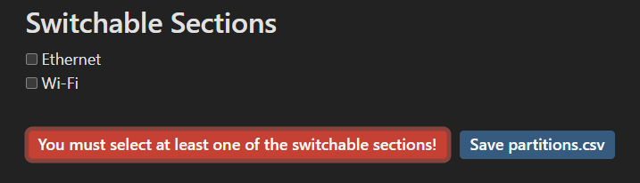
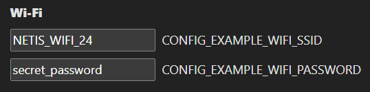
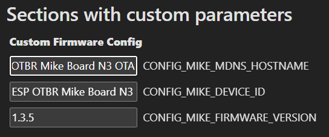
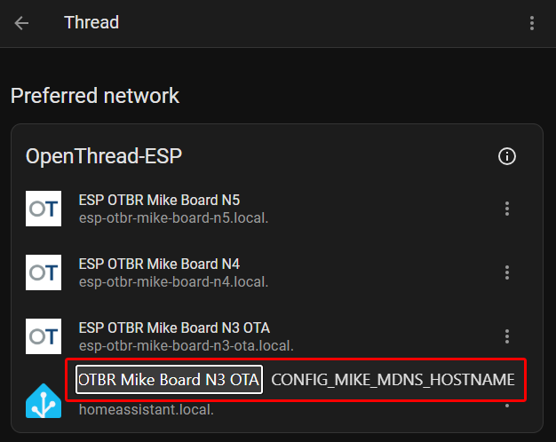
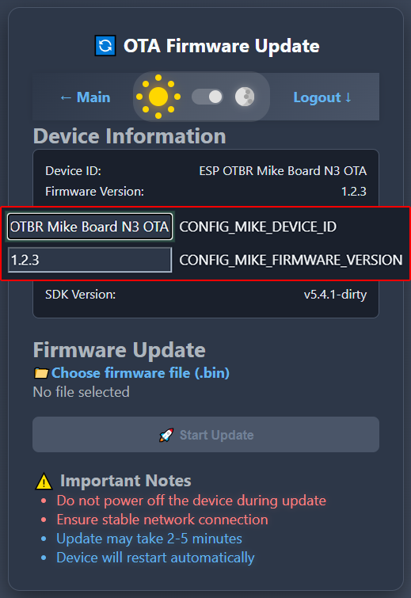
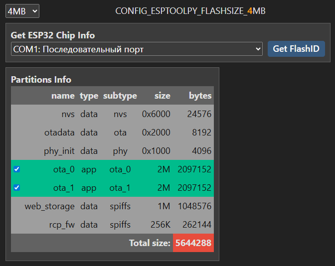
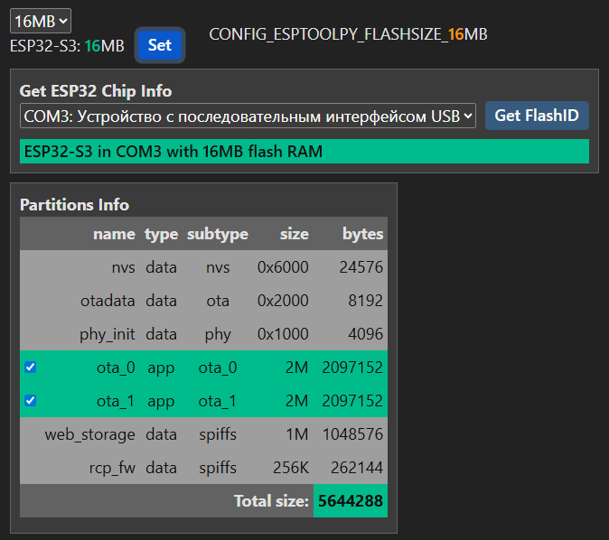
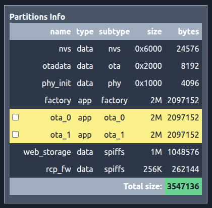

# ESP-IDF 5.4.1 OTBR Example 1.2 Optimization
Based on [ESP-THREAD-BR Release v1.2](https://github.com/espressif/esp-thread-br/releases/tag/v1.2)  
  

# 5) Yii2 ESP OTBR Config
[Return to top](README.md#otbr-top)  
- install in */web/yii2* folder (the *vendor* folder will be created):
~~~
composer install
~~~
- launch web server in */web* folder (it will be accessible on *http://localhost:8000*):
~~~
php -S 127.0.0.1:8000
~~~
- ***sdkconfig.defaults*** must have a strict structure (each configuration block must start with the line "# begin of..." and end with the line "# end of...")
~~~
\# begin of Custom Firmware Config
CONFIG_MIKE_MDNS_HOSTNAME="ESP OTBR Mike Board N3 OTA"
CONFIG_MIKE_DEVICE_ID="ESP OTBR Mike Board N3 OTA"
CONFIG_MIKE_FIRMWARE_VERSION="1.3.5"
\# end of Custom Firmware Config
~~~
  
- Section: "status" -1 means "not used, not shown" (for configurations), 0 - "switchable, now is disabled" and 1 - "switchable, now is enabled"
- Params: "custom" 0 - "not used, not shown" and 1 - "can be changed"
  
  

## Switchable Sections
At least one of the sections must be selected!  
  
"Ethernet" parameters do not need to be changed, and "Wi-Fi" parameters (SSID and password) can be set in the custom parameters section.  
  

  
## Sections with custom parameters 
  
These parameters are used to display more recognizable names in Home Assistant and on the OTA firmware web page:  
  
  
  

  
## Flash size settings
To utilize the ESP32 chip's flash memory capacity, we can use the "Get ESP32 chip information" block and select the corresponding COM port to which the ESP32 chip is connected.  
To check whether the ESP32 has sufficient flash memory, we can use the "Partition information" block, which allows you to enable/disable OTA blocks.  
The red background of the "Total size" value in "Partition Info" indicates that the Flash RAM size is insufficient for correct flashing of OTA blocks.  
  

When we select a COM port and click the "Get FlashID" button, the esptool command is launched to obtain the parameters of the ESP32 chip connected to the selected COM port.  
  

If the ESP32 chip is not connected to the COM port or is faulty, we will get an error.  
  

Correctly connecting the ESP32 to the COM port will provide information about the chip type and the size of its flash memory.  
The "Set" button will appear above the "Get ESP32 Chip Info" block.  
  
  
When we press the "Set" button that appears above the "Get ESP32 Chip Info" block, the value of the "CONFIG_ESPTOOLPY_FLASHSIZE_..." parameter will take the value of the received flash memory size.  
The green background for the "Total Size" value in "Partition Information" indicates that the Flash RAM size is sufficient for correct flashing of OTA blocks.  
  

We can use one OTA block (**not recommended!**). 
  

We can disable OTA completely.  
  

Don't forget to save changes in the corresponding files!  
  

  
## Switch theme
Switching between dark and light themes occurs by clicking the "sun/moon" icons.  
- DARK theme:  
  
  
- LIGHT theme:  
  
  
[Return to top](README.md#otbr-top)  
